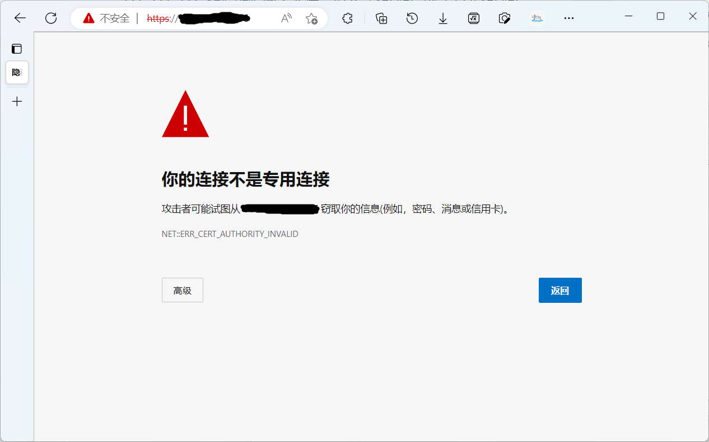
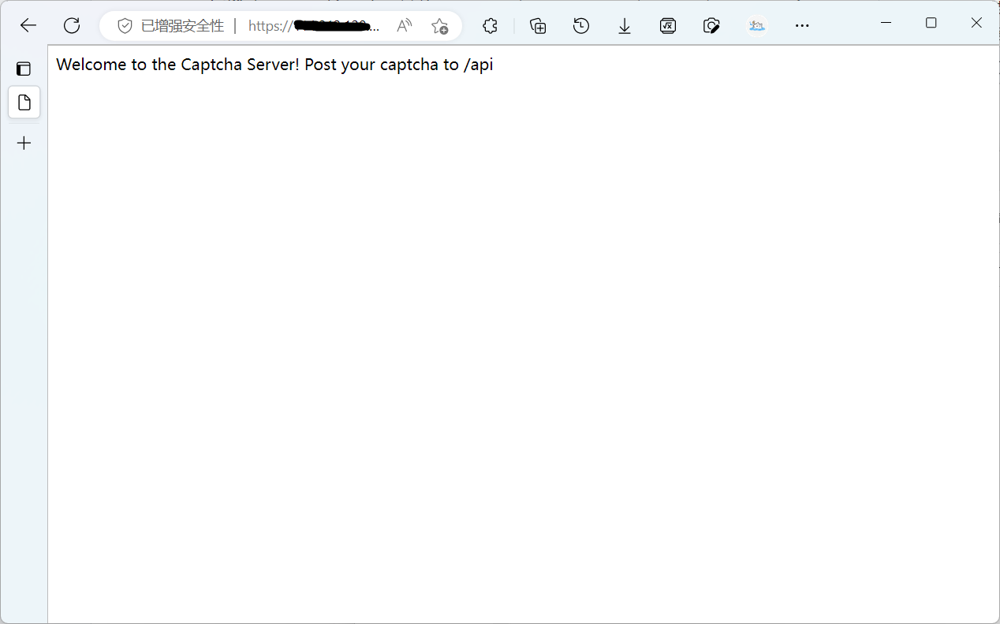

# 南大统一身份认证自动填充验证码

识别服务器代码 [server.py](server.py) [@Do1e](https://github.com/Do1e)

Tampermonkey脚本 [tampermonkey.js](tampermonkey.js) [@Bubbleioa](https://github.com/Bubbleioa)

## 使用

注：如果你的服务器已经安装了证书，可在 [server.py L25](server.py#L25) 中修改`certfile`和`keyfile`的值为你的证书路径，或者删除这两个参数使用nginx等反向代理，即可不用配置证书。

**服务器**

1. 下载 [mkcert](https://github.com/FiloSottile/mkcert/releases)
2. 打开终端运行 `./mkcert -install`，安装根证书
3. 运行 `./mkcert xxx.xxx.xxx.xxx`，生成SSL证书，其中`xxx.xxx.xxx.xxx`为你的服务器IP地址。此时得到`xxx.xxx.xxx.xxx.pem`和`xxx.xxx.xxx.xxx-key.pem`两个文件，填入 [server.py L25](server.py#L25) 中的`certfile`和`keyfile`参数。
4. 运行 `./mkcert -CAROOT` 查看根证书路径，找到该路径下的`rootCA.pem`文件，后缀改为`.crt`。
5. 运行[server.py](server.py)，Windows下 `pythonw server.py`，Linux下 `nohup python server.py &`，即可实现后台运行。

**客户端**

1. 双击安装之前保存的根证书 `rootCA.crt` 至可信任根证书颁发机构。
2. 在浏览器中访问 `https://xxx.xxx.xxx.xxx`，若提示不安全，说明证书配置失败；
   
3. 若正确提示 `Welcome to the Captcha Server! Post your captcha to /api`，说明服务器配置成功。
   
4. 修改 [send_captcha.py L20](send_captcha.py#L20) 中的 `url` 变量为你的服务器地址，并在 Tampermonkey 中安装。
5. 此时访问 [统一身份认证](https://authserver.nju.edu.cn/authserver/login) ，即可自动填充验证码。
